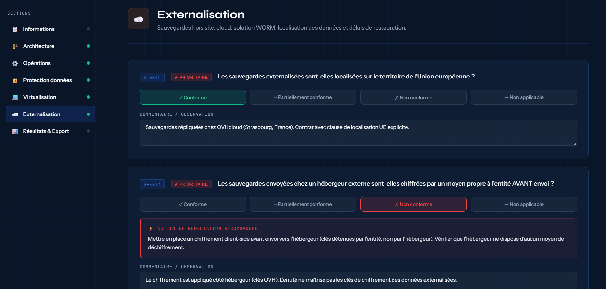
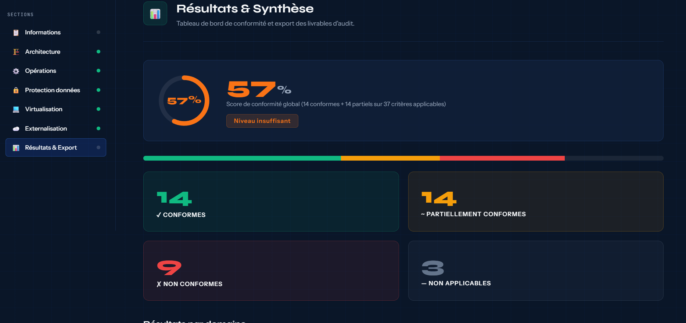
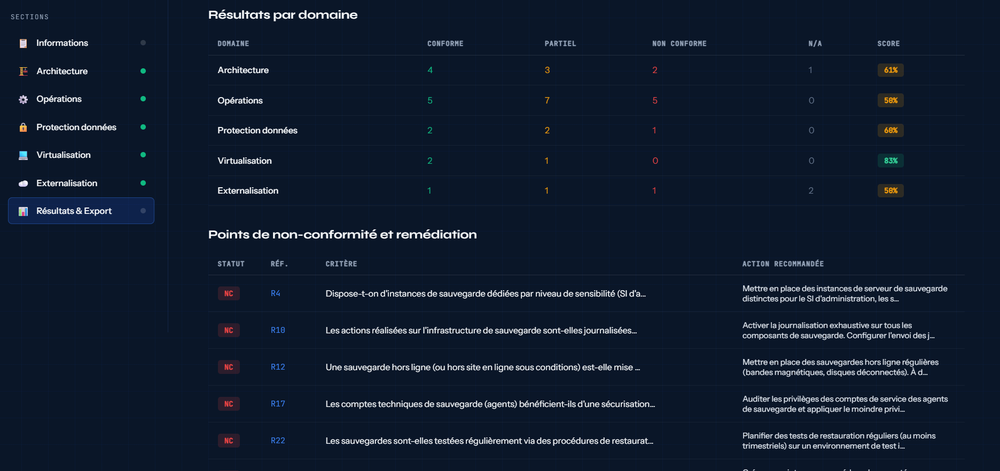

# Audit Sauvegarde SI — ANSSI-BP-100

**Outil d'audit de sauvegarde des Systèmes d'Information standalone, sans dépendance, 100% navigateur**

Un fichier HTML autonome complet pour conduire des audits de politique de sauvegarde selon les recommandations de l'ANSSI (Bonnes Pratiques BP-100 v1.1), couvrant 27 critères répartis en 5 domaines critiques.


---

## Aperçu

L'outil guide l'auditeur à travers les 5 domaines de la BP-100, affiche en temps réel les scores de conformité, propose des actions de remédiation contextuelles, puis génère automatiquement un **rapport PDF** et un **suivi Excel** exportables.

<table>
  <tr>
    <td align="center">
      <br/>
      <sub><b>Page de couverture du rapport PDF généré</b></sub>
    </td>
    <td align="center">
      <br/>
      <sub><b>Analyse de l’externalisation des services</b></sub>
    </td>
  </tr>

  <tr>
    <td align="center">
      <br/>
      <sub><b>Résultats globaux et statistiques de l’audit</b></sub>
    </td>
    <td align="center">
      <br/>
      <sub><b>Détails complets des résultats de l’audit</b></sub>
    </td>
  </tr>
</table>

---

## Fonctionnalités

- **27 critères ANSSI-BP-100 v1.1** répartis en 5 domaines (Architecture, Opérations, Protection des données, Virtualisation, Externalisation)
- **4 niveaux de réponse** par critère : Conforme / Partiellement conforme / Non conforme / Non applicable
- **Remédiation contextuelle** — action corrective ou piste d'amélioration affichée immédiatement selon la réponse
- **Score de conformité dynamique** — jauge et indicateur de niveau mis à jour en temps réel
- **Critères prioritaires** — distinction visuelle entre critères PRIORITAIRES (★) et IMPORTANTS (●)
- **Commentaires libres** — champ de saisie par critère pour observations, preuves et plans d'action
- **Export PDF** — rapport de conformité complet avec page de garde, synthèse par domaine et liste des non-conformités
- **Export Excel** — 3 feuilles : Synthèse, Plan de remédiation complet, Non-conformités isolées
- **Informations générales** — saisie du contexte : organisme, auditeur, périmètre, outil de sauvegarde utilisé
- **Navigation par sections** — barre latérale avec indicateurs de progression par domaine
- **Zéro dépendance serveur** — fonctionne entièrement en local, aucune donnée transmise

---

## Domaines couverts

| Domaine                | Critères | Thématiques principales                                                    |
| ---------------------- | -------- | -------------------------------------------------------------------------- |
| Architecture           | 10       | Cloisonnement réseau, VLAN dédié, isolation des composants, journalisation |
| Opérations             | 17       | Règle 3-2-1, comptes dédiés, RBAC, tests de restauration, patch management |
| Protection des données | 5        | Chiffrement TLS, gestion des clés, effacement sécurisé                     |
| Virtualisation         | 3        | Sauvegarde VM, isolation hyperviseur, stratégie hybride                    |
| Externalisation        | 5        | Localisation UE, chiffrement client-side, WORM, SLA de restauration        |

---

## Utilisation

### Prérequis

Aucun prérequis — le fichier s'ouvre directement dans un navigateur moderne.

| Navigateur    | Ouverture directe (`file://`) |
| ------------- | ----------------------------- |
| Firefox       | ✅                            |
| Safari        | ✅                            |
| Chrome / Edge | ✅                            |

### Lancement rapide

**Option 1 — Ouverture directe**
Double-cliquez sur `audit-sauvegarde-anssi.html` — aucune installation requise.

**Option 2 — Serveur local**

```bash
# Avec Python
python3 -m http.server 8080

# Avec Node.js
npx serve .
```

Puis ouvrez `http://localhost:8080/audit-sauvegarde-anssi.html`

### Déroulement de l'audit

1. Renseignez les **Informations générales** (organisme, auditeur, périmètre, solution de sauvegarde)
2. Parcourez chaque domaine et répondez aux critères avec l'un des 4 statuts
3. Ajoutez des **commentaires / observations** et des preuves pour chaque critère
4. Consultez les **remédiation contextuelles** affichées automatiquement pour les NC et PC
5. Accédez à la section **Résultats & Synthèse** pour visualiser le tableau de bord
6. **Exportez** le rapport PDF et/ou le suivi Excel

---

## Exports

### Rapport PDF

- Page de garde avec score global et informations d'audit
- Synthèse chiffrée par domaine
- Liste détaillée des non-conformités avec actions de remédiation recommandées
- Observations saisies par l'auditeur

### Suivi Excel (3 feuilles)

- **Synthèse** — résultats globaux et par domaine
- **Plan de remédiation** — tous les critères avec statut, action, responsable et échéance à compléter
- **Non-conformités** — tableau filtré sur les NC et PC uniquement, prêt à partager

---

## Scoring

Le score de conformité est calculé sur les critères **applicables** (hors N/A) :

```
Score = (Conformes + Partiels × 0.5) / Critères applicables × 100
```

| Score     | Niveau                 |
| --------- | ---------------------- |
| ≥ 80 %    | ✅ Niveau satisfaisant |
| 60 – 79 % | ⚠️ Niveau à améliorer  |
| 40 – 59 % | 🔶 Niveau insuffisant  |
| < 40 %    | 🔴 Niveau critique     |

---

## Structure du projet

```
audit-sauvegarde-anssi.html   # Fichier unique autonome
README.md                     # Ce fichier
LICENSE                       # Licence applicable
```

---

## Référentiels couverts

- **ANSSI BP-100 v1.1** — Recommandations de sécurité pour les systèmes de sauvegarde
- **Guide d'administration sécurisée ANSSI** — Référencé dans les critères d'opérations (R13)
- **Règle 3-2-1** — Standard international de sauvegarde (R11, R12)
- **RGPD** — Prise en compte de la localisation des données (R-EXT1) et de l'effacement sécurisé (R32)

---

## Contribution

Les contributions sont les bienvenues :

- 🐛 Signaler un bug via les [Issues](../../issues)
- 💡 Proposer un nouveau critère ou une mise à jour ANSSI via les [Issues](../../issues)
- 🔧 Soumettre une amélioration via une [Pull Request](../../pulls)

---

## Licence

MIT License — voir le fichier LICENSE pour les détails.

---

## Avertissement

Cet outil est fourni à titre indicatif et pédagogique. Les résultats générés ne constituent pas un audit de sécurité officiel ni une certification. Les recommandations s'appuient sur les publications publiques de l'ANSSI disponibles sur [messervices.cyber.gouv.fr](https://messervices.cyber.gouv.fr/documents-guides/anssi_fondamentaux_sauvegarde_systemes_dinformation_v1.1.pdf).
